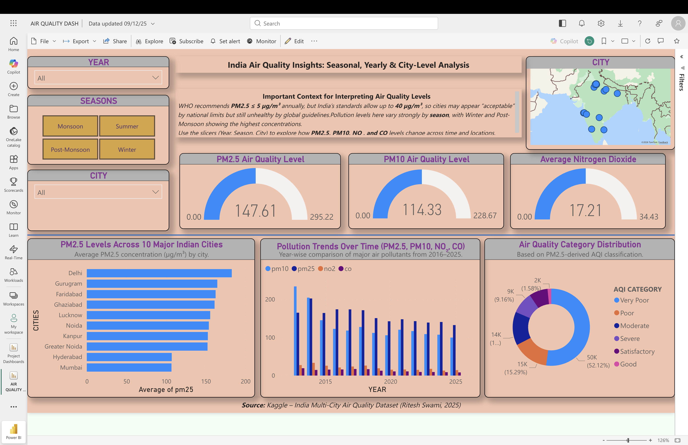

# India Air Quality Insights Dashboard

## Overview
This project is an interactive Power BI dashboard built to analyze air quality trends across major Indian cities. It focuses on seasonal, yearly, and city-level pollution patterns using key indicators such as PM2.5, PM10, NO₂, and CO.

## Dashboard Preview

## Objective
The goal of this project was to transform raw air quality data into an interactive and decision-friendly dashboard that helps users explore pollution trends across time, geography, and seasonality.

## Dataset
The project uses a multi-city air quality dataset containing pollutant measurements across major Indian cities over multiple years.

## Data Cleaning and Preparation
Before building the dashboard, I cleaned and transformed the dataset in Power Query by:
- removing missing and incomplete records
- filtering unreliable historical entries from older years
- correcting data types
- standardizing fields for more consistent analysis
- preparing the data for year, season, and city-level filtering

## Dashboard Features
- KPI cards for PM2.5, PM10, and NO₂
- city-wise comparison visuals
- pollution trend analysis over time
- AQI category distribution
- map-based city visualization
- interactive filters for year, season, and city

## Key Analytical Questions
This dashboard was designed to answer:
- How does air quality change over time?
- Which cities are most affected?
- How do seasonal patterns influence pollution levels?

## Skills Demonstrated
- Power BI
- Power Query
- Data Cleaning
- Data Visualization
- Dashboard Design
- Interactive Reporting
- Data Storytelling

## Files Included
- Power BI dashboard file (.pbix)
- Dashboard screenshot
- README documentation
